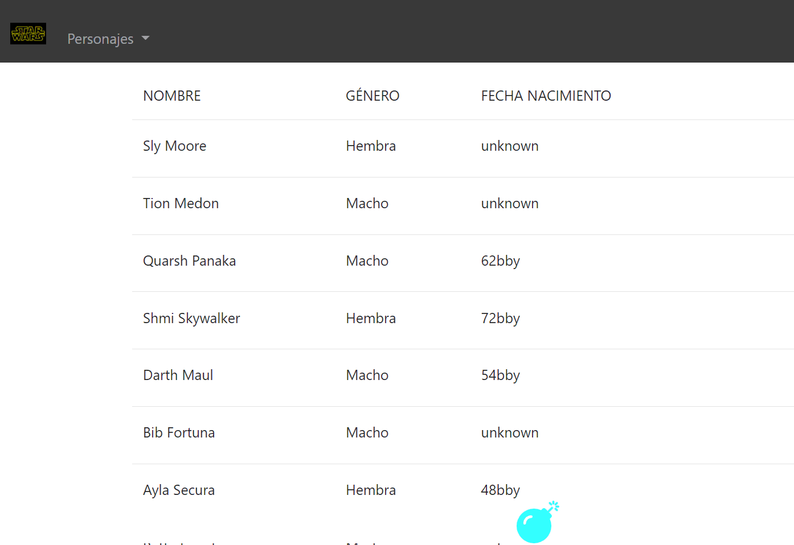

## EXÁMEN  PROGRAMACIÓN WEB DIM XLIII ABR21
Empleo Nombre y apellidos:    

Fecha y hora:

## Normas Generales para la Prueba
1. Durante la realización del examen queda prohibido el uso ( incluido funcionamiento en segundo plano) de cualquier aplicación que facilite la conexión de cualquier tipo con un tercero.   
_El incumplimiento de este apartado supondrá  la calificación más baja (cero)  en el presente examen._
1. Todas las páginas del examen deben tener su nombre y apellidos manuscrito.    
1. Inicie una grabación de sus dos pantallas, al completo,  con la aplicación `OBS`, recuerde que el formato de salida debe ser `.mkv`. Al finalizar el examen deberá subir la grabación (con su nombre) a la carpeta `172.16.250.202/fase-presente/25.Angular/VIDEOSEXAMEN`. En la grabación debe verse desde el apartado 4 de estas Normas Generales hasta el `commit` final del examen.  
    _La imposibilidad del visionado del vídeo, su visionado parcial, su falta  o no se grabe la totalidad de las pantallas supondrá la calificación más baja (cero) en el presente examen_

    La prueba consiste en realizar una serie de ejercicios en sin tiempo límite y subirlo a un repositorio online.
1. Cree un repositorio en https://git.institutomilitar.com/ con:  
    1. el nombre `ExamenApellido`, donde Apellido es su apellido característico.
    1. La  visibilidad  debe ser privada. 
1. Clone el repositorio del apartado anterior  a local. 
1. Modifique el `README.md`, o generelo si no exite, poniendo su nombre, apellidos y motivo del repositorio.
1. Realice un `commit` con la modificación anterior y súbala al repositorio del apartado 4. 
1. Los recursos necesarios (imágenes) para realizar el examen están en: `172.16.250.202/fase-presente/25.Angular/img`
1. Puede utilizar las librerías que crea necesarias.
1. No se podrán utilizar componentes ni módulos hechos por terceros más alla de los propiamente solicitados  
    

1. Se valorará  el uso de:  
    1. (2 puntos) Se indique siempre el tipo y lo que devuelven los métodos
    1. (2 puntos) El uso de `template literals`
    1. (2 puntos) Las varibles trasversales a la aplicación tenerlas en el `environment`
    1. (2 puntos) Usar `arrowFunctions`
    1. (2 puntos) El uso de interfaces
    1. (2 puntos) El uso de interfacesImplementadas 
    1. (2 puntos) La capacidad de exportación de los módulos que se generen
    1. (2 puntos) Que cada ruta tenga su propio módulo
    1. (2 puntos) Que no haya errores en la consola del navegador cuando entregue el examen
    1. (2 puntos) No haya mensajes de ningún tipo en la consola del navegador
    1. (2 puntos) Que el código no tenga errores
    1. (2 puntos) Minimizar las llamadas a la API
    1. (2 puntos) No haya código inservible
    1. (2 puntos) El codigo este bien identado y según las guías de estilo que se siguen el Departamento de Sistemas de la Información y Ciberdefensa (DptoSIC) (`https://google.github.io/styleguide/`)
    1. (2 puntos) Que la aplicación muestre algo en el navegador distinto a un error o una pantalla en blanco
1. El uso de estilos css en línea o internos no se tendrá en cuenta y **restará en el apartado guía de estilo 5 (cinco) puntos**
1. Las llamadas  a la API o a los `json` se deben hacer mediante servicios sino **restará en el apartado guía de estilo 10 (diez) puntos**
1. El examen consta de 270 puntos entre la guía de estilo y las preguntas a completar.
1. El 5 (cinco), que es el aprobado del examen,  se obtiene alcanzando 135 puntos. 
1. Cuando finalice el examen debe hacer un `commit`  con el texto `fin de examen` y subirlo al repositorio `git` que creo en el apartado 4.  
1. Durante la realización del examen no se podrá abandonar el puesto donde está su equipo, **el abandono del puesto supondrá la finalización del examen y se tendrá en cuenta para su corrección el último commit que haya realizado antes de abandonar su puesto**.
1. El examen está planteado sobre la temática de `STARWARS` y consistirá en mostrar una serie de persojajes y planetas, para ello deberá apoyarse en la api pública `https://swapi.dev` 
1. Si a lo largo del examen no implementa la conexiónes necesarias a la API, en la carpeta `172.16.250.202/fase-presente/25.Angular/datos` podrá encontrar el archivo `datos.ts` donde están los datos que devuelve la API necesarios para el examen. El uso de este archivo supondrá obtener la puntuación de 0 (cero) puntos en los apartados en los que se le solicite acceder a la API.
  
  

# A partir de aquí se pide:

1. Genere una aplicación angular con las siguientes características:
   1. (1 punto) Enrutamiento 
    1. (2 punto) Se llame `ExamenNombre` (sustituya nombre por su apellido característico). 
    1. (1 punto) La aplicación debe incluir estilos en línea en el archivo TS del componente.
    1. (1 punto) No deben generarse los archivos de prueba (`spec.ts`).  
1. (1 punto) Realice un commit al repositorio git de `gitInstitutoMilitar` con el texto `aplicación angular generada`. 
1. Cuando use el comando de `Node Package Manager` para levantar la apliación de desarrollo debe:
    1. (1 punto) Abrir la aplicación en el navegador por defecto de su equipo   
    1. (1 punto) En el puerto `4234`
1. La aplicación debe tener  aspecto  `bootstrap`. La versión que utilice debe ser superior a `4.0.0`.
    1. (1 punto) Las dependencias deben aparecer en el `package.json`
    1. (2 puntos) Debe estar referenciado todo lo necesario en el  `angular.json` en el orden correcto.
    1. (1 punto) La aplicación debe tener aspecto bootstrap
1. (3 puntos) El tamaño de letra para todas las interfaces gráficas que muestre la aplicación debe ser de `20px`.  
1. (8 puntos) Genere un `layout` de la aplicación de tal forma que haya un `header` y un `footer` siempre visible y que las distintas interfaces gáficas que debe generar, a lo largo del examen, se muestren entre el `header` y el `footer`, según las siguientes premisas:
    1. (2 puntos) Este `layout` debe estar en un módulo aparte
    1. (1 punto) Tener un componente contenedor
    1. (4 puntos) Ese componete contenedor debe tener componentes especificos para cada parte.  
    1. (1 punto) Mostrarse correctamente 
1. (3 puntos) En el `footer` debe aparecer un icono de `fontawesome` de la versión que usted desee pero el `framework` que está utilizando para está aplicación web debe gestionar las dependencias de `fontawesome`. _Nota: Use `npm` (Node Package Manager)._
    1. (1 punto) El icono debe estar centrado en el footer
    1. (1 punto) De un tamaño superior al tamaño por defecto.
    1. (1 punto) Inicialente cuando haga `click` sobre el icono debe dirigirme a `https://git.institutomilitar.com/`.  
    1. (1 punto) Cuando el DptoSIC cambie de dominio habrá que cambiar la url, facilite las tareas de mantenimiento y ponga la citada url en el lugar adecuado.   
      

1. (8 puntos) En la parte izquierda del `header` de la aplicación debe mostrar en produción el logo `darthVader.jpg` y en desarrollo el logo `startwars.png`. 
    
1. Cuando se arranque la aplicación y al pulsar sobre el logo del apartado anterior se debe mostrar el home de la aplicación, según las siguientes premisas:
    1. (2 puntos) Debe estar en un módulo con enrutamiento  
    1. (1 punto) La url que mostrará el navegador debe ser: `http://localhost:4234`  
    1. (3 puntos) Se mostrará el texto `home works!` en un tamaño de letra de `80px`. _Nota: recuerde que los estilos en linea e internos en los archivos `html` no están permitidos en el presente examen_  

1. (5 puntos) En el `header` de la aplicación debe aparecer el texto `Personajes`, cuando haga `click` en ese texto me debe dirigir a la url `http://localhost:4234/personajes` y  mostrar al menos diez (10) personajes de las películas de `STARTWARS`, con las siguientes características:  
    1. (11 puntos) `Personajes` debe ser un módulo aparte con los componentes que crea convenientes. 
    1. (20 puntos) El módulo `Personajes` debe tener un acceso a datos.
    1. (12 puntos) Las propiedades que tiene un personaje en la aplicación que está generando son las siguientes (entre paréntesis tiene su correspondencia con los datos que sirve la api):  
        * nombre (`name`)
        * estatura (`height`)
        * peso (`mass`)
        * colorPelo (`hair_color`)  
        * colorPiel (`skin_color`)  
        * colorOjos (`eye_color`)  
        * fechaNac (`birth_year`)  
        * genero (`gender`) 
        * planeta (`homeword`)  
        * peliculas (`films`)  
        _Nota: el resto de propiedades que hay en la api no se desean_  
          

    1. (10 puntos) Se debe mostrar (similar al de la imagen) el nombre,  género  y fechaNac de cada personaje.  
      
    1. (2 puntos) fechaNac debe estar en **minúsculas** en todos los personajes.  
    1. (8 puntos) En función el género (`gender`) se debe mostrar en español  (macho=`male` y hembra=`female`) y si su valor es `n/a` debe mostrar el texto `Sin Género`  
1. (33 puntos) En `http://localhost:4234/personajes` cuando pulso sobre el nombre de un personaje me debe mostrar en un modal los datos completos de ese personaje ( recuerde que hay propiedades de la api que no se quieren en nuestra aplicación web) (_Nota: No pierda el tiempo en hacer una interface gráfica óptima con mostrar los datos en formato `json` es suficiente_)  
1. (2 puntos) Cada Personaje debe tener un botón que se llame `Planeta` en formato bootstrap:  
    1. Cuando pulse el botón:
       1. (14 puntos) Se  debe comunicar (de la forma que desee) a un nuevo componente el planeta del personaje.
        1. (8 puntos) Mostrarse en una pantalla  las características del planeta de ese Personaje. _Nota: es sufienciente con que lo muestre en formato `json`_
    1. El módulo responsable de mostrar la pantalla del apartado anterior tiene que: 
        1. (6 puntos) Tener su propio enrutamiento.
        1. (6 puntos) Su propio acceso a datos.  
          

1. En la pantalla personajes se debe mostrar también el color de pelo de los personajes. Tenga en cuenta que algunos personajes como los robots no tienen pelo y otros como `Darth Vader` tampoco, se le pide:
    1. Si el personaje tiene pelo ponga muestre el color de su pelo.
    1. Si el personaje no tiene pelo o es calvo muestre el texto `No tengo pelo`
1. Cuando se abre el modal con el detalle de cada personaje (apartado 11):
    1. (2 puntos) Además de los datos de ese personaje, debe aparecer un botón de bootstrap en color rojo con el texto eliminar.
    1. (8 puntos) Al presionar ese botón debe comunicar al componente que tiene todos los personajes que hay que eliminar ese personaje. Por la consola del navegador debe aparecer el texto `He eliminado a : nombre` donde _nombre_ es el nombre del personaje que ha eliminado.
    1. (5 puntos) Después de borrar el personaje ya no se debe mostrar en la pantalla de personajes.
    _Nota: Tenga en cuenta que al ser una API pública no le va a permitir hacer modificaciones en ella, con que lo borre en memoria es suficiente_  
1. (3 puntos) Cree una interface gráfica que nos permita crear nuevos personajes con las siguientes características:
    1. (4 puntos) Se debe acceder a ella mediante la url `http://localhost:4234/personajes/formulario`
    1. (2 puntos) En el `header`  de su aplicación debe haber un texto que ponga `Crear Personaje` y me dirija al formulario.
    1. (1 punto) El formulario debe tener dos campos **obligatorios** con las siguientes características:
        1. Campo nombre:
            * (1 punto) Longitud mínima = 3
        1. Campo fecha Nacimiento:
            * (1 punto) Longitud mínima = 5
            * (1 punto) Longitud máxima = 5  
    1. (8 puntos) En función de que se cumplan los requerimientos de cada campo el color de los recuadros debe cambiar. _Nota: los selectores bootstrap tipo clase `is-valid` y `is-invalid`  son los encargados de mostrar los inputs de color verde o rojo_
    1. (5 puntos) Si el formulario está completo correctamente se habilitará un botón con el texto `Crear Personaje` que al presionarlo:  
        1. (2 puntos) Debe aparecer un mensaje en la consola del navegador con el personaje creado con todas sus propiedades.
        1. (4 puntos) Debe dirigir a `http://localhost:4234/personajes/`  

**FIN EXAMEN**
