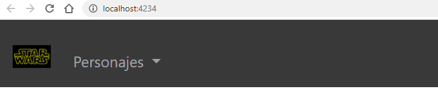

*. Se valorará positivamente el uso de:  
  1. Se indique siempre el tipo y lo que devuelven los métodos
  1. El uso de template literals
  1. Las varibles trasversales a la aplicación tenerlas en el `environment`
  1. Usar `arrowFunctions`
  1. El uso de interfaces
  1. El uso de ibterfacesImplementadas 
  1. La capacidad de exportación de los módulos que se generen
  

1. Genere una aplicación angular con enrutamiento que se llame `ExamenNombre` (sustituya nombre por su apellido característico). La aplicación debe incluir estilos en línea en el archivo TS del componente y no deben generarse los archivos de prueba (`spec.ts`).
1. Realice un commit al repositorio git de `gitInstitutoMilitar` con el texto `aplicación angular generada`. 
1. Cuando use el comando de `Node Package Manager` para levantar la apliación de desarrollo debe abrirme la aplicaicón en el navegador por defecto de mi equipo en el puerto `4234`
1. La aplicación debe tener  aspecto  `bootstrap`. La versión que utilice debe ser superior a `4.0.0`.
1. El tamaño de letra para todas las interfaces gráficas que muestre la aplicación debe ser de `20px`.
1. Genere un `layout` de la aplicación de tal forma que haya un `header` y un `footer` siempre visible y que las distintas interfaces gáficas que debe generar se muestresn entre ese `header` y `footer`.
1. En el `footer` debe aparecer un icono de `fontawesome` de la versión que usted desee pero el `framework` que está utilizando debe gestionarlas. _Nota: Use `npm` (Node Package Manager)._
  1. El icono debe estar centrado en el footer
  1. Inicialente cuando haga `click` sobre el icono debe dirigirme a `https://git.institutomilitar.com/`, pero cuando el departamento de Sistemas de la Información y Ciberdefensa (DptoSIC) cambie de dominio habrá que cambiar la url, facilite las tareas de mantenimiento y ponga la citada url en el lugar adecuado. 
1. En la parte izquierda del `header` de la aplicación debe mostrar en produción el logo `darthVader.jpg` y en desarrollo el logo `startwars.png`. 
    
1. Al pulsar sobre el logo del apartado anterior me debe dirigir al home de la aplicación donde se mostrará el texto `home works!` en un tamaño de letra de `80px`. _Nota: recuerde que los estilos en linea e internos en los archivos `html` no están permitidos en el presente examen_
1. En el `header` de la aplicación debe aparecer el texto `Personajes`, cuando `click` en ese texto me debe dirigir a la url `http://localhost:4234/personajes` y  mostrar al menos diez (10) personajes de las películas de `STARTWARS`, con las siguientes características:  
  1. Se debe mostrar el nombre (`name`),  género (`gender`) y año de nacimiento (`birth_year`)
  1. En función el género se debe mostrar en español y si su valor es `n/a` debe mostrar el texto `Sin Género`
1. En `http://localhost:4234/personajes` cuando pulso sobre el nombre de un personaje me debe mostrar en un modal los datos completos de ese personaje (_Nota: No pierda el tiempo en hacer una interface gráfica optima con mostrar los datos en formato json es suficiente_)  
1. Cada Personaje debe tener un botón que se llame `Mundo` en formato bootstrap:
  1. Este botón solo se mostrará si el personaje tiene la propiedad `hair_color` distinta del valor `n/a`, si tuviera ese valor deberá mostrar el texto `No tengo pelo`
  1. Cuando pulse el botón me debe dirigir a una pantalla que me muestre las carácteristicas del mundo (`homeworld`) de ese personaje. _Nota: es sufienciente con que lo muestre en formato `json`_
